This page provides an overview of Verilog, its significance, and practical examples of digital design using Verilog. We will explore three fundamental designs in this experiment:

1. **T-Flip Flop**
2. **Counter**
3. **T-Flip Flop Using D-Flip Flop**

---

Verilog is a hardware description language (HDL) developed to model electronic systems. It enables designers to describe the structure and behavior of digital circuits, facilitating simulation, synthesis, and verification. The modular nature of Verilog allows for efficient design, testing, and reuse of code.

---

## 1. T-Flip Flop

The Verilog code for a T-Flip Flop is shown below, accompanied by an explanation of its components:

<p align="center">
  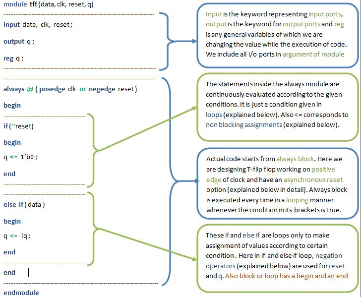
</p>

### Key Concepts

- **Module:**  
  A module is the fundamental building block in Verilog. It can represent a single element or a collection of lower-level design blocks. Modules encapsulate functionality and expose interfaces through input and output ports, allowing for abstraction and reuse.

- **Module Name:**  
  The module name is user-defined and is used to instantiate the module elsewhere in the design. Instantiation is demonstrated in the third example.

- **Module Arguments:**  
  Similar to function arguments in C, module arguments specify the input and output ports used for communication with other modules or the external environment.

- **Input/Output Ports:**  
  These ports facilitate data transfer into and out of the module. All arguments listed in the module declaration must be defined as either input or output within the module.

- **Data Types:**  
  In this example, the `reg` data type is used. Other data types, such as `wire`, will be introduced in subsequent examples. Refer to the chart below for an overview of Verilog data types:

  <p align="center">
    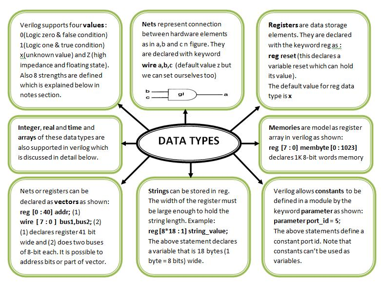
  </p>

- **Always Block:**  
  The `always` block contains statements that execute repeatedly, triggered by changes in specified signals (e.g., clock or reset).

- **Posedge Clock:**  
  The `posedge` (positive edge) of the clock triggers the execution of statements within the `always` block, corresponding to a transition from low to high voltage.

- **Negedge Reset:**  
  The `negedge` (negative edge) of the reset signal asynchronously sets the output to zero, regardless of the clock.

- **Operators and Lexical Conventions:**  
  Operators such as `~` (bitwise NOT) and `!` (logical NOT) are used in Verilog. The chart below summarizes various operators and conventions:

  <p align="center">
    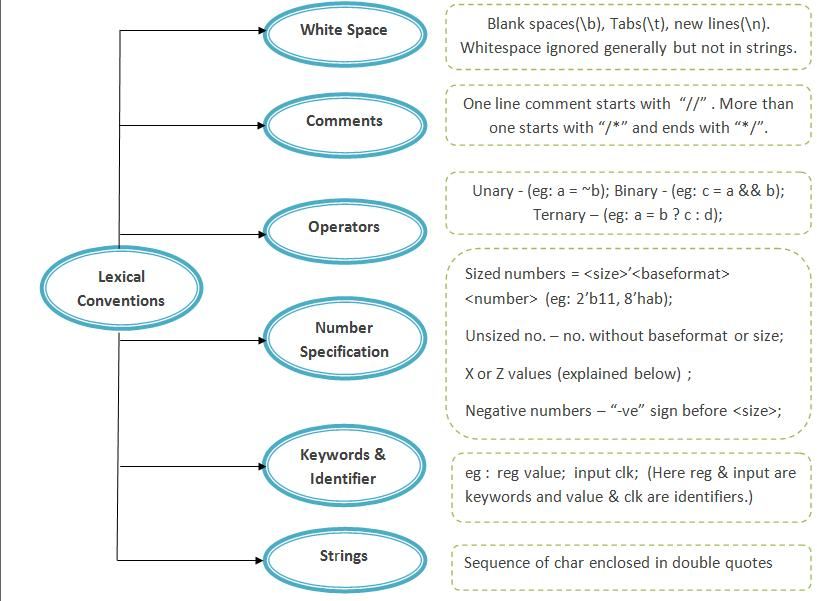
  </p>

- **Loops:**  
  Verilog supports control structures such as `for`, `if-else`, and `while`, similar to C. These structures use `begin` and `end` to define statement blocks.

- **Blocking and Non-Blocking Assignments:**
  - **Blocking (`=`):** Statements execute sequentially.
  - **Non-Blocking (`<=`):** Statements execute concurrently.  
    For example:
    ```
    a = b;
    b = a;
    ```
    Both `a` and `b` will have the value of `b`.  
    Using non-blocking assignment:
    ```
    a <= b;
    b <= a;
    ```
    The values are swapped simultaneously.

---

## 2. Counter

The Verilog code for a counter is provided below, with explanations for each part:

<p align="center">
  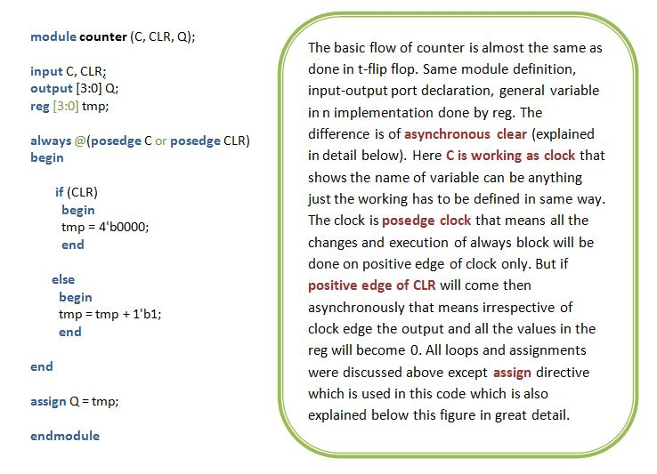
</p>

### Additional Notes

- **Assign Statement:**  
  The `assign` keyword is used for continuous assignment. For example, `assign Q = tmp;` ensures that `Q` is updated immediately whenever `tmp` changes, regardless of execution sequence.

---

## 3. T-Flip Flop Using D-Flip Flop

The Verilog code for implementing a T-Flip Flop using a D-Flip Flop is shown below:

<p align="center">
  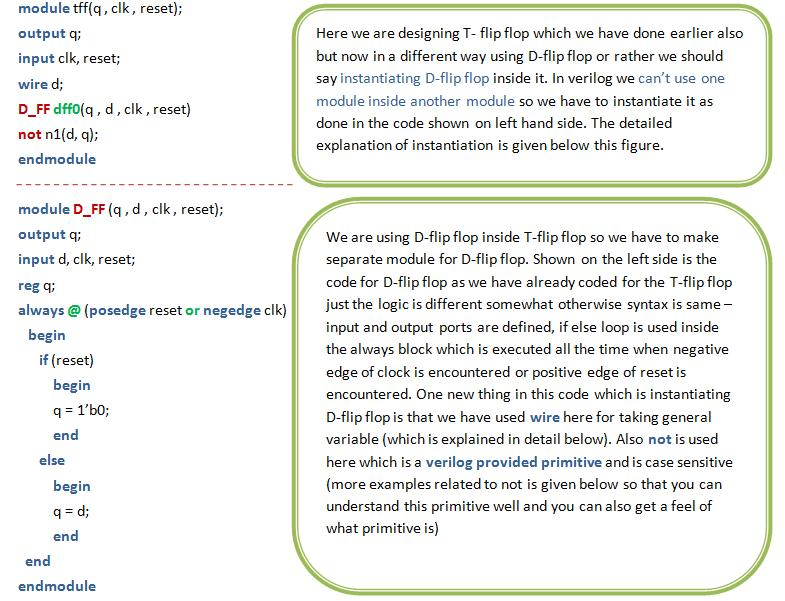
</p>

### Key Concepts

- **Module Instantiation:**  
  Modules are not defined within other modules; instead, they are instantiated (called) as needed. The module is referenced by its original name, but each instance must have a unique identifier. For example, the module `D_FF` is instantiated as `dff0`.

- **Verilog Primitives:**  
  Verilog provides built-in primitives such as `not`. In `not (d, q);`, `d` is the output and `q` is the input.

- **Compiler Directives and System Tasks:**  
  While not used in the above examples, Verilog supports compiler directives and system tasks for advanced functionality. Refer to the flowcharts below for more information:

  <p align="center">
    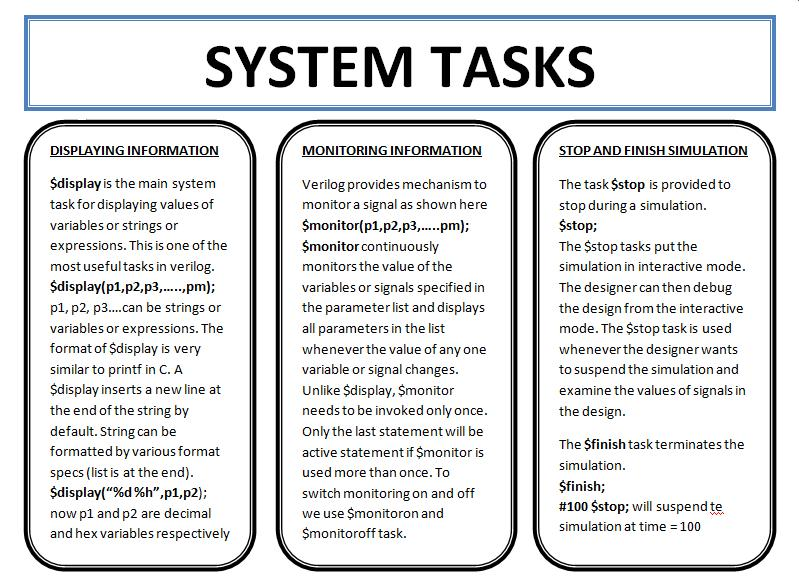
  </p>
  <p align="center">
    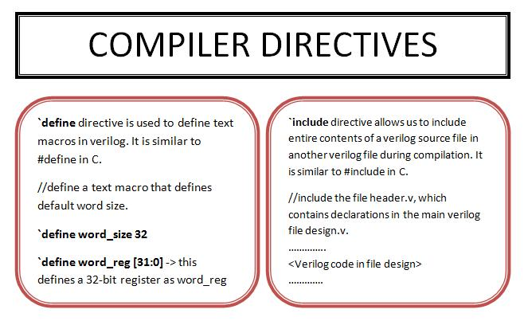
  </p>

---

## Comparator

A digital comparator is a combinational circuit that compares two binary numbers and determines their relative magnitudes. Comparators are widely used in digital systems for tasks such as sorting, arithmetic operations, and control applications.

### 1-Bit Comparator

The operation of a single-bit digital comparator can be described by the following truth table:

| A   | B   | A > B | A = B | A < B |
| --- | --- | ----- | ----- | ----- |
| 0   | 0   | 0     | 1     | 0     |
| 0   | 1   | 0     | 0     | 1     |
| 1   | 0   | 1     | 0     | 0     |
| 1   | 1   | 0     | 1     | 0     |

### 2-Bit Comparator

The operation of a two-bit digital comparator is shown below:

| A<sub>1</sub> | A<sub>0</sub> | B<sub>1</sub> | B<sub>0</sub> | A < B | A = B | A > B |
| :-----------: | :-----------: | :-----------: | :-----------: | :---: | :---: | :---: |
|       0       |       0       |       0       |       0       |   0   |   1   |   0   |
|       0       |       0       |       0       |       1       |   1   |   0   |   0   |
|       0       |       0       |       1       |       0       |   1   |   0   |   0   |
|       0       |       0       |       1       |       1       |   1   |   0   |   0   |
|       0       |       1       |       0       |       0       |   0   |   0   |   1   |
|       0       |       1       |       0       |       1       |   0   |   1   |   0   |
|       0       |       1       |       1       |       0       |   1   |   0   |   0   |
|       0       |       1       |       1       |       1       |   1   |   0   |   0   |
|       1       |       0       |       0       |       0       |   0   |   0   |   1   |
|       1       |       0       |       0       |       1       |   0   |   0   |   1   |
|       1       |       0       |       1       |       0       |   0   |   1   |   0   |
|       1       |       0       |       1       |       1       |   1   |   0   |   0   |
|       1       |       1       |       0       |       0       |   0   |   0   |   1   |
|       1       |       1       |       0       |       1       |   0   |   0   |   1   |
|       1       |       1       |       1       |       0       |   0   |   0   |   1   |
|       1       |       1       |       1       |       1       |   0   |   1   |   0   |

<p align="center">
  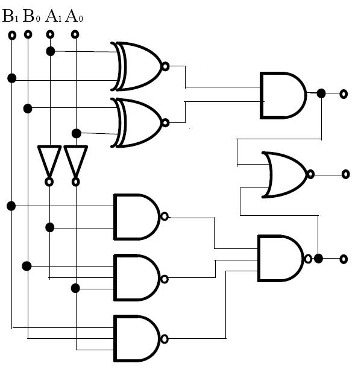
</p>

### Implementation

Let  
A = A<sub>3</sub>A<sub>2</sub>A<sub>1</sub>A<sub>0</sub>  
B = B<sub>3</sub>B<sub>2</sub>B<sub>1</sub>B<sub>0</sub>

where each subscript represents a bit in the binary numbers.

#### Equality

Two binary numbers A and B are equal if all corresponding bits are equal, i.e.,  
A<sub>3</sub> = B<sub>3</sub>, A<sub>2</sub> = B<sub>2</sub>, A<sub>1</sub> = B<sub>1</sub>, and A<sub>0</sub> = B<sub>0</sub>.

The Boolean function for equality of any two bits A<sub>i</sub> and B<sub>i</sub> is:

<p align="center">
  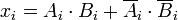
</p>

Here, x<sub>i</sub> is 1 only if A<sub>i</sub> and B<sub>i</sub> are equal.

For overall equality, all x<sub>i</sub> (for i = 0, 1, 2, 3) must be 1.  
Thus, the equality condition can be implemented as:

(A = B) = x<sub>3</sub> x<sub>2</sub> x<sub>1</sub> x<sub>0</sub>

The output (A = B) is 1 only if all corresponding bits of A and B are equal.

#### Inequality

To determine which of two binary numbers is greater, compare the bits starting from the most significant bit (MSB) and proceed to the least significant bit (LSB) until a difference is found. If A<sub>i</sub> = 1 and B<sub>i</sub> = 0 at the first differing position, then A > B.

This sequential comparison can be expressed logically as:

<p align="center">
  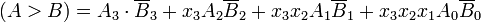
</p>

<p align="center">
  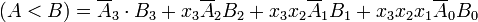
</p>

The outputs (A > B) and (A < B) are binary variables that are high (1) when A is greater than B or less than B, respectively.
