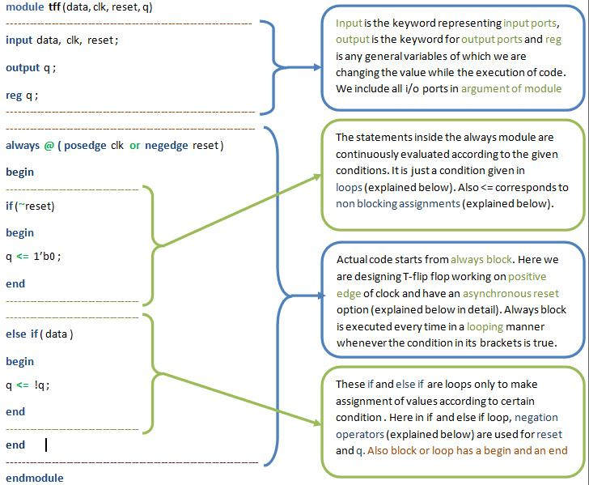
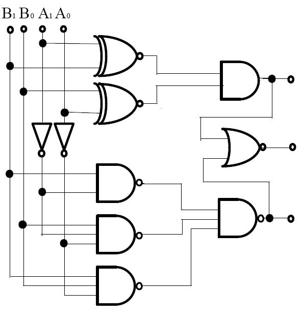
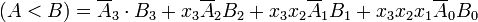

## VERILOG

As we have seen in introduction what verilog is all about, why verilog was developed, what is its need, what is the advantages using verilog, now we are ready to make some digital designs using verilog. We will learn three basic designs which are listed below in this experiment.  

1. T-Flip Flop  
2. Counter  
3. T-Flip Flop usind D-Flip Flop  

**T-FLIP FLOP**

The verilog code for T-flip flop is given below with explaination of different parts of code.  

  

Some of the following points which are not explained in detail in the above image are explained here below  

**MODULE**  

Verilog provides the concept of a module. A module is the basic building block in verilog. A module can be an element or a collection of lower-level design blocks. Typically, elements are grouped int mmodules to provide common functonality that is used at many places in the design. A module provides the necessary functionality to the higher-level block through its port interface (inputs and outputs), but hides the internal implementation. This allows the designer to modify module internals without affecting the rest of the design.  

**MODULE NAME**  

Module name can be anything accordig to our own choice. It is just another name consisting of characters and numbers. It is used when module is instantiated in another module. We instantiate by calling the module using the name given to it. Instiating the module is explained in the third example code given below.  

**ARGUMENTS IN MODULE**  

Just as in C function we give some arguments to function, here also we give arguments which consists of all the input and output ports which that module is using to take input fromthe user and give output to the user.  

**INPUT-OUTPUT PORTS - I/O PORTS**  

Input and Output ports are the ports through user can give inputs and take outputs. Whatever arguments we have given to module should be mentioned inside the module that which arguments correspond to input ports and which correspond to output ports as done in the image above.   

**DATA TYPES**

Here in this example we have used *reg* data type and in upcoming examples we will be using some more as *wire* and all. So to know about various kinds of operators in verilog just read the following chart carefully.  

**ALWAYS BLOCK**

All statements inside an always statement consists of always block. The always statement starts at time 0 and executes the always statement in the looping fashion continuously according to the condition given in the bracket of always block after "@".  

**POSEDGE CLOCK**  

Posedge clock is written in the bracket of always statement means that the statements inside the always block will be executed only at the positive edge of the clock, that is, only when clock goes from low level to high level or generally 0V level to 5V level.  

**NEGEDGE RESET**  

Reset is also a pulse here when the negative edge of reset is encountered then asynchronously that means irrespective of the clock the output will be set to zero. Negative edge means reset will go from high level to low level.  

OPERATORS AND OTHER LEXICAL CONVENTIONS  

~ and ! opertars are used in the above code. Apart from these there are various operators, numbers and identifiers provided by verilog. All of these are shown in figure below  

  

**LOOPS**  

Verilog also supports *for*, *if-else*, *while* loops as in C. In the above example if and else are used. The syntax for all loops is same as C just the difference is that they have a *begin* and *end* to denote the statements inside a loop.  

**BLOCKING AND NON-BLOCKING ASSIGNMENT**  

Blocking statement is specified by = operator and Non-Blocking statement is specified by <= operator. Suppose there are two statements  
*a = b*
*b = a*
Then both a and b will get values equal to b but if in place of equal to sign we place less than equal to operator, that is, if we use non blocking assignment then bith statement will be executed at same time, that is a will get the value of b and b will get the value of a at the same time so the values will be swapped. Hence statements with non-blocking assignment is started executing simultaneously.  

**COUNTER**

The verilog code for counter is given below with explaination of different parts of code.  

  

In tha above code, everything is pretty much explained in the box on right hand side given above. Just the *assign* statement is new so it is explained here. When we use assign before a statement like in above example Q=tmp, it means Q will be updated as soon as the value in tmp register changes whether or not it comes in the execution sequence or not. This is the speciality of assign keyword.  

**T_FLIP FLOP USING D-FLIP FLOP**  

The verilog code for the T-flip flop using D-flip flop is given below with explaination of different parts of code.  

  

In the above example instantiation of module is used which is explained in detail here.  

**INSTANTIATION OF MODULE**  

We does not use module inside a module, thats why we instantiate it that means we call it as we call some function. One important thing to not while instantiating is that we call module with same name as we have given it while coding for it separately but when we are using it in other module we give it some other name and if it is instantiated more than one time then we have to give different name each time. Here in above example we have called the module with same name D_FF but given a new name dff0.  

**NOT - VERILOG PROVIDED PRIMITIVE**  

There are many primitives already defined in verilog which provides some particular functionalities. not is one of them. In not first argument is output value and second is input value. So in above example d is output and q is input.  

Verilog also provides us with some compiler directives and system tasks. These are not used in above programs but if you want to know about these functionalities, read the following flowcharts.  

  

  

## COMPARATOR

The operation of a single bit digital comparator can be expressed as a truth table:

**Inputs**&nbsp;&nbsp;&nbsp;&nbsp;&nbsp;&nbsp;&nbsp;&nbsp;&nbsp;&nbsp;&nbsp;&nbsp;**Outputs**

|A  |	B  |	A > B |	A = B |	A < B|
|---|------|----------|-------|------|
|0  |	0  |	0     |	1     |	0    |
|0  |	1  |	0     |	0     | 1    |
|1  | 	0  | 	1     | 0     | 0    |
|1  |   1  | 	0     |	1     |	0    |

The operation of a two bit digital comparator can be expressed as a truth table: 

**Inputs**&nbsp;&nbsp;&nbsp;&nbsp;&nbsp;&nbsp;&nbsp;&nbsp;&nbsp;&nbsp;&nbsp;&nbsp;&nbsp;&nbsp;&nbsp;&nbsp;&nbsp;&nbsp;&nbsp;&nbsp;&nbsp;&nbsp;&nbsp;&nbsp;&nbsp;&nbsp;&nbsp;&nbsp;&nbsp;&nbsp;&nbsp;&nbsp;&nbsp;&nbsp;&nbsp;&nbsp;**Outputs**

|A1|A0 | B1|  B0 | A < B| A = B| A > B|
|-------------|-------------|--------------|----------------|------|------|------|
|0 	      |	0 	    |	0 	   |  	0 	    |	0  |	1 |	0|
|0 	      |	0 	    | 	0 	   |	1 	    |	1  |	0 |	0|
|0 	      |	0 	    |	1 	   |	0 	    |	1  |	0 |	0|
|0 	      |	0 	    |	1 	   |	1 	    |	1  |	0 |	0|
|0 	      |	1 	    |	0 	   |	0 	    |	0  |	0 |	1|
|0 	      |	1 	    |	0 	   |	1 	    |	0  |	1 |	0|
|0 	      |	1 	    |	1 	   |	0 	    |	1  |	0 |	0|
|0 	      |	1 	    |	1 	   |	1 	    |	1  |	0 |	0|
|1 	      |	0 	    |	0 	   |	0 	    |	0  | 	0 |	1|
|1 	      |	0 	    |	0 	   |	1 	    |	0  |	0 |	1|
|1 	      |	0 	    |	1 	   |	0 	    |	0  |	1 |	0|
|1 	      |	0 	    |	1 	   |	1 	    |	1  |	0 |	0|
|1 	      |	1 	    | 	0 	   |	0 	    |	0  |	0 |	1|
|1 	      |	1 	    |	0 	   |	1 	    |	0  |	0 |	1|
|1 	      |	1 	    |	1 	   |	0 	    |	0  |	0 |	1|
|1 	      |	1 	    |	1 	   |	1 	    |	0  |	1 |	0|

Following is the circuit digram for the two bit comparator : 

**Implementation**

A = A3A2A1A0

B = B3B2B1B0

Here each subscript represents one of the digits in the numbers.

**Equality**

The binary numbers A and B will be equal if all the pairs of significant digits of both numbers are equal, i.e.,

A3 = B3, A2 = B2, A1 = B1 and A0 = B0

Since the numbers are binary, the digits are either 0 or 1 and the boolean function for equality of any two digits Ai and Bi can be expressed as

xi is 1 only if Ai and Bi are equal.

For the equality of A and  B, all xi variables (for i=0,1,2,3) must be 1.

So the quality condition of A and B can be implemented using the AND operation as

(A = B) = x3x2x1x0

The binary variable (A=B) is 1 only if all pairs of digits of the two numbers are equal.

**Inequality**

In order to manually determine the greater of two binary numbers, we inspect the relative magnitudes of pairs of significant digits, starting from the most significant bit, gradually proceeding towards lower significant bits until an inequality is found. When an inequality is found, if the corresponding bit of A is 1 and that of B is 0 then we conclude that A>B.

This sequential comparison can be expressed logically as:

  

 

  

(A>B) and (A < B) are output binary variables, which are equal to 1 when A>B or A<B respectively.

 

